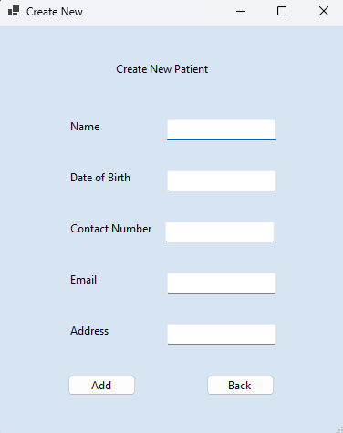
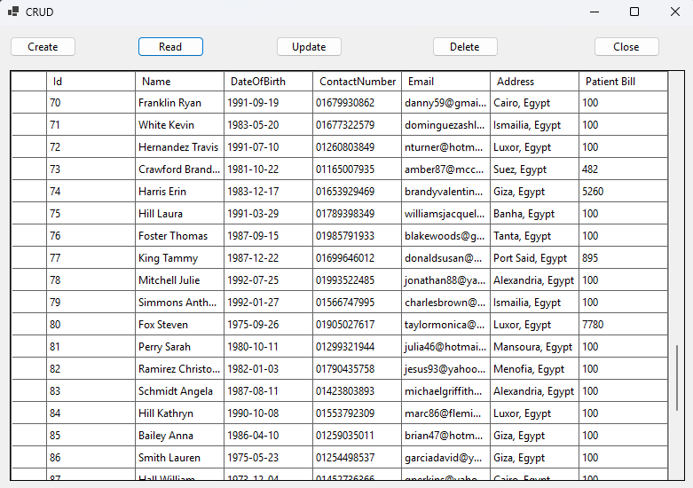
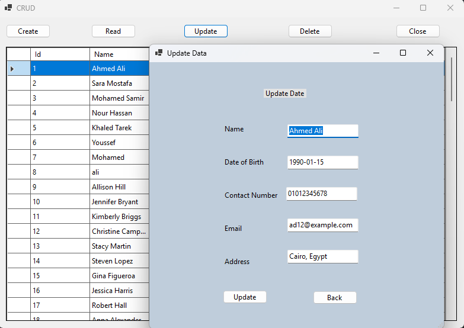
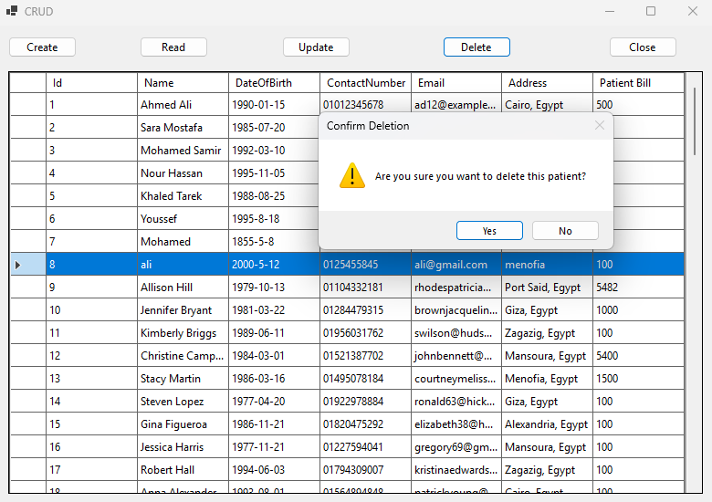

# 🏥 Integrated Medical Center (Windows Forms + SQLite)

Integrated Medical Center is a **Windows Forms Application** built using **C# (.NET)** with **SQLite** database.  
The project mainly focuses on demonstrating **CRUD Operations** (Create, Read, Update, Delete) on patient records.

---

## ✨ Features
- 📌 **Patient Management (CRUD)**  
  - ➕ Create new patient record  
  - 📖 Read and display patient details  
  - ✏️ Update existing patient information  
  - ❌ Delete patient records  

- 💾 **SQLite Database Integration**  
- 🖥️ **Windows Forms UI** for user-friendly interaction  

---

## 🛠️ Technologies Used
- C# (.NET Windows Forms)  
- SQLite (lightweight database)  

---

## 📸 Preview

### ➕ Create Patient

### 📖 Read Patients

### ✏️ Update Patient

### ❌ Delete Patient

---
